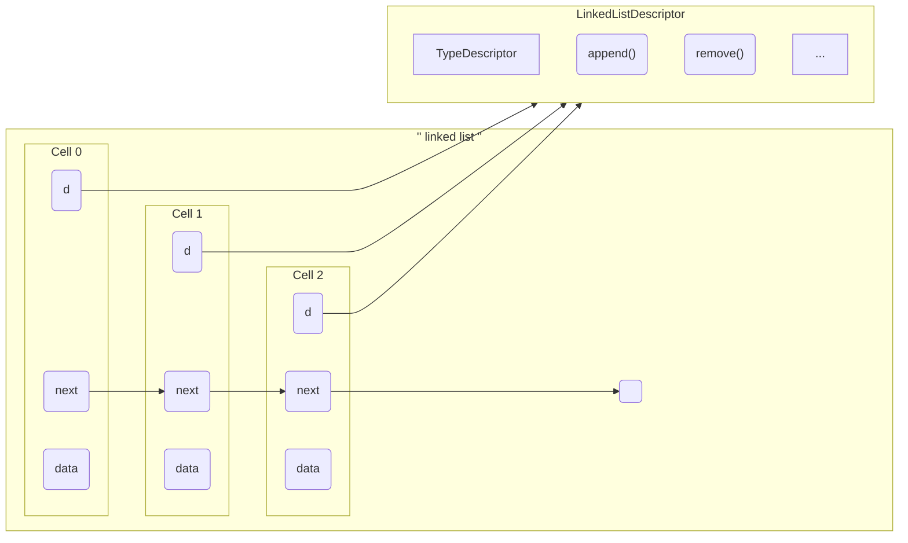
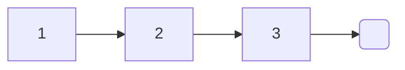
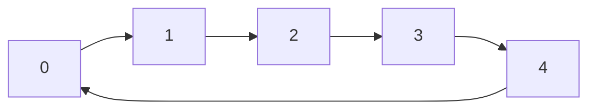
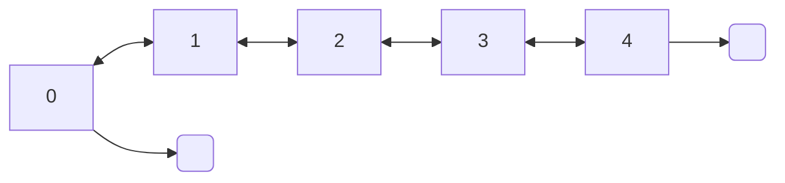
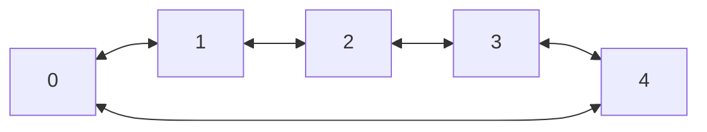
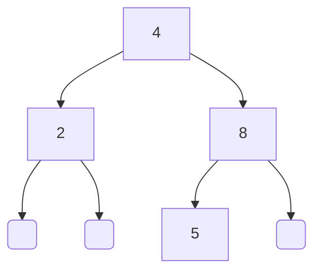

# MyLittleCLibrary
An ANSI C library gathering things I learned in college, to implement things faster for my homework and projects.

[](https://github.com/cydaw6/MyLittleCLibrary/actions/workflows/c-cpp.yml)  
[](#license)  
[](https://cydaw6.github.io/MyLittleCLibrary/html/index.html)

## Index

|  	| Data struct 	| Overview 	| Examples               	|
|--------	|-------------	|----------	|------------------------	|
| Lists
| | Array list	|      [:clipboard:](#Array-list)   | [:file_folder:](#Linked-list) 	|
| | Linked list 	|      [:clipboard:](#Linked-list)   | [:file_folder:](#Linked-list) 	|
| | Circular linked list 	|  [:clipboard:](#Circular-linked-list)  | [:file_folder:](#Circular-linked-list) |
| | Double linked list 	|  [:clipboard:](#Double-linked-list)  | [:file_folder:](#Double-linked-list) |
| | Circular double linked list 	|  [:clipboard:](#Circular-double-linked-list)  | [:file_folder:](#Circular-double-linked-list) 	|
| Trees
| | Binary search tree |    [:clipboard:](#Binary-search-tree)   | [:file_folder:](#Binary-search-tree) 	|
| | AVL tree	|    [:clipboard:](#AVL-tree)   | [:file_folder:](#AVL-tree) 	|

## Introduction

All the structures are linked to a descriptor (called 'd') trough which they pass to use the associated functions, and the [type descriptor](##Type-manifest), allowing to manipulate the data independently of the *effective* type they are carrying.  You specify the data carried by the structure at creation.
For example the linked list is implemented like this :



Each cell is linked to the linked list descriptor, when adding new data to the list, a cell (the last, the first, depending on the function) is passing his 'd' pointer to the cell builder. The type descriptor is freed when the last remaining cell is removed.
You use the linked list this way:
```c
LinkedList l;
int x;

x = 1;
l = new_linked_list(&x, int_m);

/* You have to way of using the struct functions */

/* 
	By using the descriptor
	(Never forget that the list can't be empty to access the descriptor, so l != NULL)
*/
x = 2;
l->d->append(&l, &x);

/* Or by using the global name function */
x = 3;
linked_list_append(&l, &x);
```
The functions of a structures call other function trough the descriptor.

By doing so, we can override the methods behavior be using custom ones
`l->d->append = mycustomappendfunction; `
or

```c
void custom_fprint_for_the_data_of_my_linked_list(FILE * stream, const void * data){
	if(stream && data)
		fprintf("***-- %c --***", *(char *) data);
}
...
LinkedList l;
char c;

c = 'a';
l = new_linked_list(&x, int_m);
l->d->type_descriptor->fprint = custom_fprint_for_the_data_of_my_linked_list;
```


> Feel free to explore the test module to see more examples of use.

## Lists

### Array list

**[ 0 ][ 1 ][ 2 ][ 3 ][ 4 ]**

```c  
int x;  
LinkedList l;  
  
x = 5f;  
l = new_array_list(int_m);
  
l->d->append(&l, &x);  
l->d->free(&tmp);  
  
```  


### Linked list


```c  
float x;  
LinkedList l;  
  
x = 5.3f;  
l = new_linked_list(&x, float_m);  
  
l->d->append(&l, &x);  
l->d->free(&tmp);  
  
```  

### Circular linked list

```c  
int x;  
CircularLinkedList l;  
  
x = 5;  
l = new_circular_linked_list(&x, int_m);  
  
l->d->append(&l, &x);  
l->d->free(&tmp);  
  
```  

### Double linked list

```c  
int x;  
DoubleLinkedList l;  
  
x = 5;  
l = new_double_linked_list(&x, int_m);
  
l->d->append(&l, &x);  
l->d->free(&tmp);  
```  

### Circular double linked list


```c  
int x;  
CircularDoubleLinkedList l;  
  
x = 5;  
l = new_circular_double_linked_list(&x, int_m);
  
l->d->append(&l, &x);  
l->d->free(&tmp);  
```  

## Trees

### Binary search tree


```c  
int x;  
CircularDoubleLinkedList l;  
  
x = 4;  
l = new_binary_search_tree(&x, int_m);
  
x = 8; l->d->add(&l, &x);  
x = 2; l->d->add(&l, &x);
x = 5; l->d->add(&l, &x);

l->d->free(&tmp);  
```  

##  Type manifest

###  What's that

All the structures are linked to a *TypeDescriptor*, an interface required to manipulate the data they are carrying.

It requires (for now), few things:
- the size of the type you want to use
- some functions to print the data
- a function to free the data and another one to copy the data  (deep or not, you decide if you make your own)
- some comparison functions

The *TypeDescriptor* gets this through a type manifest which handle specific functions of the type to be manipulated.  
Its like defining you own type in Python (\_\_str__, \_\_eq__, \_\_lt__, etc...).

When making new structures you passes the manifest of the type you want they carry :
```c
ArrayList l = new_array_list(int_m); /* Voilà, you have got a brand new array list of int */
```
### Define your own type

Let's look at the *char_m*(anifest) for example:

```c  
/*   src/basic_types.c */  
void char_m(TypeDescriptor * td){  
	assert(type_descriptor);  
  td->data_size = sizeof(char);  
  td->manifest = char_m;  
  td->cmp = char_cmp;  
  td->print = char_print;  
  td->fprint = char_fprint;  
  td->copy = char_copy;  
  td->free_data = char_free;  
  td->eq = char_eq;  
  td->lt = char_lt;  
  td->le = char_le;  
  td->gt = char_gt;  
  td->ge = char_ge;  
}  
  
int char_cmp(const void * x, const void * y){  
	return (*(char *) x == *(char *) y) ? 0 : (*(char *) x < *(char *) y) ? -1 : 1;  
}  
  
int char_eq(const void * x, const void * y){  
	return (*(char *) x) == (*(char *) y);  
}  
  
int char_lt(const void * x, const void * y){  
	return (*(char *) x) < (*(char *) y);  
}  
  
int char_le(const void * x, const void * y){  
	return (*(char *) x) <= (*(char *) y);  
}  
  
int char_gt(const void * x, const void * y){  
	return (*(char *) x) > (*(char *) y);  
}  
  
int char_ge(const void * x, const void * y){  
	return (*(char *) x) >= (*(char *) y);  
}  
  
void char_print(const void * x){  
	char_fprint(stdout, x);  
}  
  
void char_fprint(FILE * stream, const void * x){  
	if(!x)  fprintf(stream, "Null");  
  fprintf(stream, "%c",  *(char *) x);  
}  
  
void * char_copy(const void * data){  
	void * alloc_data;  
	size_t data_size;  
	data_size = sizeof(char);  
	alloc_data = calloc(1, data_size);  
	if(!alloc_data) return NULL;  
	memcpy(alloc_data, data, data_size);  
	return alloc_data;  
}  
  
void char_free(void ** x){  
	if(!*x) return;  
	free(*x);  
	*x = NULL;  
}

/*    
	By making your own type_manifest you will be able to use your custom Type through
	the lib's implemented structures. Like so:    
*/
 
int main(){  
 char c; 
 CircularLinkedList l;  
 c = 'a'; 
 l = new_circular_linked_list(&x, char_m);     
 l->d->free(&tmp);  
 return 0;
}
```


## Extended Examples


### Double Linked List of Circular double linked lists
```c  
DoubleLinkedList l;  
CircularDoubleLinkedList l_2;  
float x;  
  
x = 3.14f;  
l_2 = new_circular_double_linked_list(&x, float_m);  

/* If we suppose that you already defined a circular double linked list manifest */
l = new_double_linked_list(&l_2, circular_double_linked_list_m);  

l->d->append(&l, &x); 
l->d->free(&tmp);  
```  

```c
int main(){    
	/* Making a new TypeDescriptor */     
	TypeDescriptor td;    
	td = new_type_descriptor(char_m);      
	/*      
		Allocating a TypeDescriptor is done inside      
		the constructor of the structure, so you just have to pass the manifest directly.   
	*/    
	char c;   
	CircularLinkedList l;    
	c = 'a';   
	l = new_circular_linked_list(&x, char_m);       
	/*      
		You can redefine the TypeDescriptor of a structure by its own descriptor.     
		Its has effect on all the structure, so you know what you are doing.   
	*/  
	type_descriptor_free(&l->d->type_descriptor);    
	l->d->type_descriptor = td;
	l->d->free(&tmp);
	return 0;
}
```


# Credits

Doxygen css from jothepro [doxygen-awesome-css]([github.com/jothepro/doxygen-awesome-css)
