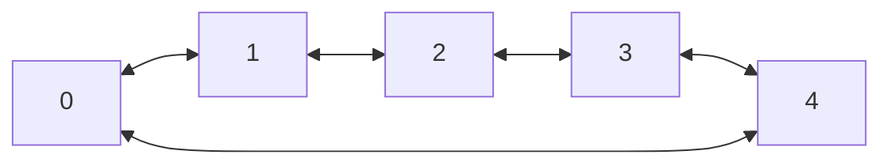

### Circular double linked list

<div style="text-align: center;">

</div>

```c
int x;
CircularDoubleLinkedList *list = new_double_linked_list(int_m);

for(i = 0; i < 5; i++)
circuluar_double_linked_list_append(list, new_int(i);

circuluar_double_linked_list_free(&list);

```

