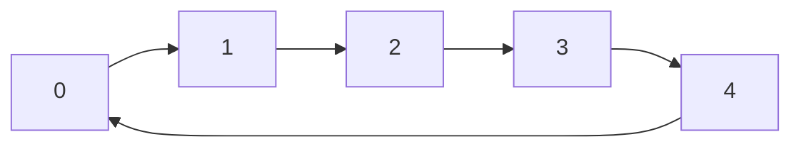

### Circular linked list

<div style="text-align: center;">

</div>

```c
int i;
CircularLinkedList *list = new_circular_linked_list(int_m);

for(i = 0; i < 5; i++)
    circular_linked_list_append(list, new_int(i)); 

circular_linked_list_free(&list);    
``` 

