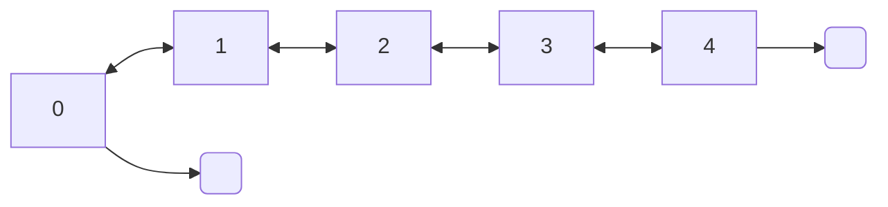

### Double linked list

<div style="text-align: center;">

</div>

```c 
int x;
DoubleLinkedList *list = new_double_linked_list(int_m);  

for(i = 0; i < 5; i++)
    double_linked_list_append(list, new_int(i); 
    
double_linked_list_free(&list);
```

#### To dot
```c
double_linked_list_to_dot(list, "doublelinkedlist.dot");
```