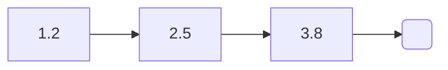

### Linked list

<div style="text-align: center;">

</div>

```c 
LinkedList *list = new_linked_list(float_m);

linked_list_append(list, new_float(1.2f));  
linked_list_append(list, new_float(2.5f));  
linked_list_append(list, new_float(3.8f));

linked_list_free(&list); 
```


#### Add

##### Append
```c
x = 2.5f;  
linked_list_append(&l, &x);  
x = 1.2f;  
linked_list_append(&l, &x);
/* [2.5, 1.2] */
```

##### Prepend
```c
x = 2.5f;  
linked_list_prepend(&l, &x);  
x = 1.2f;  
linked_list_prepend(&l, &x);
/* [1.2, 2.5] */
```

#### Sorting

##### Merge sort
```c
linked_list_merge_sort(list, int_lt);
```

#### To dot
```c
linked_list_to_dot(list, "linkedlist.dot");
```