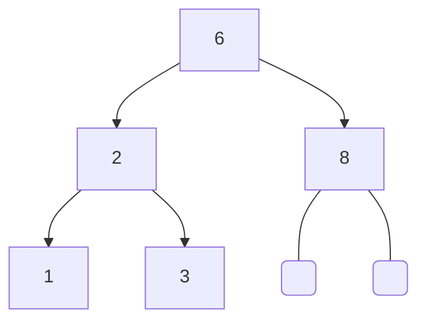

### AVL tree

<div style="text-align: center;">

</div>

```c  
AVLTree *tree = new_avl_tree(int_m);

binary_search_tree_add(tree, new_int(6));    
binary_search_tree_add(tree, new_int(8));  
binary_search_tree_add(tree, new_int(1));
binary_search_tree_add(tree, new_int(3));
binary_search_tree_add(tree, new_int(2));

binary_search_free(&tree);  
``` 