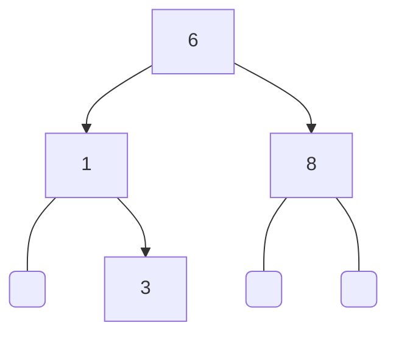

### Binary search tree

<div style="text-align: center;">

</div>

```c  
BinarySearchTree *tree = new_binary_search_tree(int_m);

binary_search_tree_add(tree, new_int(6));    
binary_search_tree_add(tree, new_int(8));  
binary_search_tree_add(tree, new_int(1));
binary_search_tree_add(tree, new_int(3));

binary_search_tree_free(&tree);  
```  

#### To dot
```c
binary_search_tree_to_dot(list, "bst.dot");
```