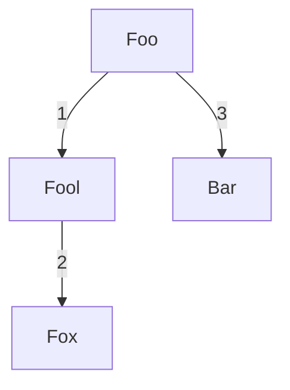

### BK Tree

<div style="text-align: center;">

</div>


```c
BKTree *tree = new_bk_tree();

bk_tree_add(tree, "Foo");
bk_tree_add(tree, "Bar");
bk_tree_add(tree, "Fool");
bk_tree_add(tree, "Fox");

bk_tree_free(&tree);
```

#### Fuzzy search

#### To dot
```c
bk_tree_to_dot(list, "bktree.dot");
```