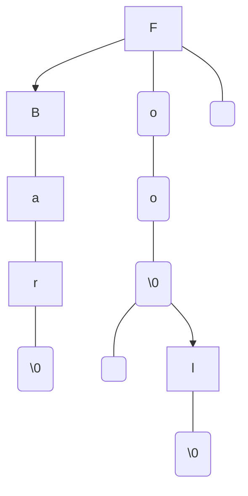

### Ternary Search Tree (Lexical Tree)

<div style="text-align: center;">

</div>


```c
TernarySearchTree *tree = new_ternary_search_tree();

ternary_search_tree_add(tree, "Foo");
ternary_search_tree_add(tree, "Bar");
ternary_search_tree_add(tree, "Fool");

ternary_search_tree_free(&tree);
```