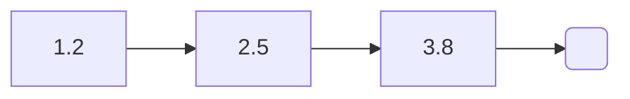
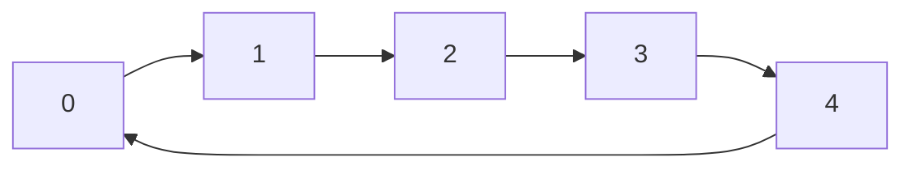
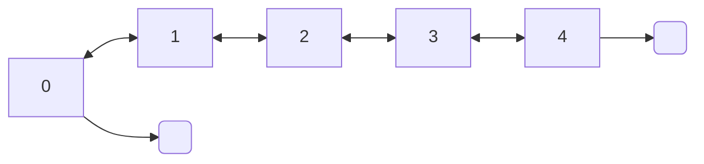
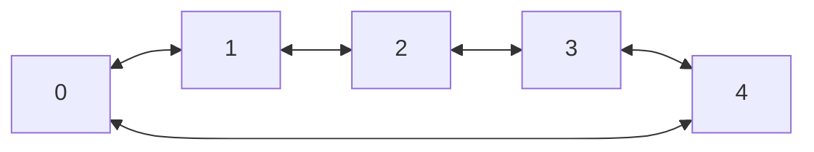

### Array list

<div style="text-align: center;">
[ 0 ][ 1 ][ 2 ][ 3 ][ 4 ]
</div>

```c 
int i; 
ArrayList *list = new_array_list(int_m);   

for(i = 0; i < 5; i++)  
    array_list_append(list, &i);
    
array_list_free(&list);  
```   


#### Sorting

##### Bubble sort
```c
array_list_bubble_sort(list, int_lt);
```

##### Insertion sort
```c
array_list_insertion_sort(list, int_lt);
```

##### Selection sort
```c
array_list_selection_sort(list, int_lt);
```

##### Merge sort
```c
array_list_merge_sort(list, int_lt);
```

##### Quick Sort
```c
array_list_quick_sort(list, int_lt);
```

### Linked list

<div style="text-align: center;">

</div>

```c 
LinkedList *list = new_linked_list(float_m);

linked_list_append(list, new_float(1.2f));  
linked_list_append(list, new_float(2.5f));  
linked_list_append(list, new_float(3.8f));

linked_list_free(&list); 
```


#### Add

##### Append
```c
x = 2.5f;  
linked_list_append(&l, &x);  
x = 1.2f;  
linked_list_append(&l, &x);
/* [2.5, 1.2] */
```

##### Prepend
```c
x = 2.5f;  
linked_list_prepend(&l, &x);  
x = 1.2f;  
linked_list_prepend(&l, &x);
/* [1.2, 2.5] */
```

#### Sorting

##### Merge sort
```c
linked_list_merge_sort(list, int_lt);
```

#### To dot
```c
linked_list_to_dot(list, "linkedlist.dot");
```

### Circular linked list

<div style="text-align: center;">

</div>

```c
int i;
CircularLinkedList *list = new_circular_linked_list(int_m);

for(i = 0; i < 5; i++)
    circular_linked_list_append(list, new_int(i)); 

circular_linked_list_free(&list);    
``` 

### Double linked list

<div style="text-align: center;">

</div>

```c 
int x;
DoubleLinkedList *list = new_double_linked_list(int_m);  

for(i = 0; i < 5; i++)
    double_linked_list_append(list, new_int(i); 
    
double_linked_list_free(&list);
```


### Circular double linked list  

<div style="text-align: center;">

</div>

```c
int x;
CircularDoubleLinkedList *list = new_double_linked_list(int_m);

for(i = 0; i < 5; i++)
circuluar_double_linked_list_append(list, new_int(i);

circuluar_double_linked_list_free(&list);

```

### List
The list interface provides basic methods for the different list implementation

A circular linked list of strings:

```c  
List *list = new_list(LINKED_LIST, str_m);  
  
list_append(list, "hell");  
list_append(list, "shell");  
list_append(list, "Foo");  
list_append(list, "bar");  
list_append(list, "Bubble");  
    
l_free(&list);  
```  

#### Limitation
Some of the list implementation have specific methods, other don't. So you will have to understand how structs are shaped. For example if you want to benefit of the sorting methods of the *ArrayList* through the *List* interface, you would do:

```c  
list = new_list(ARRAY_LIST, int_m);  
...  
array_list_merge_sort(list->s.array_list);  
```  
You will notice that here we access the *ArrayList* implementation through the **s** (for "structure") field, depending on the type of implementation we set to create the *List*.

#### Methods
[Header file](https://github.com/cydaw6/MyLittleCLibrary/blob/main/include/Lists/MLCL_List.h)
