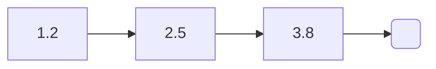
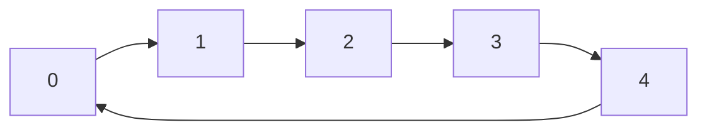
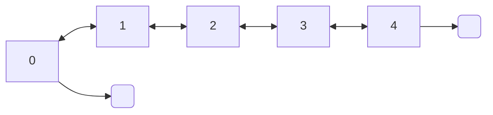
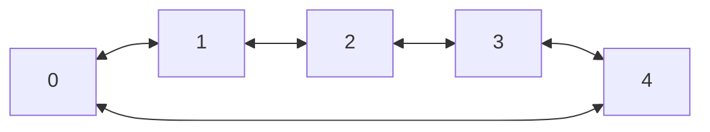

### List
The list interface provide a basic methods for the different list implementation

A circular linked list of char:
```c
List *l;

l = new_list(LINKED_LIST, str_m);

/* add some values */
l->append(l, "hell");
l->append(l, "shell");
l->append(l, "Foo");
l->append(l, "bar");
l->append(l, "Bubble");

/* Print the list */
l->print(l);

l->free(&l);
```

#### Extended use of lists implementation
Some of the list implementation have specific methods, other don't. So you will have to understand how structs are shaped. For example if you want to benefit of the sorting methods of the ArrayList trough a list you would do:
```c
l = new_list(ARRAY_LIST, int_m);
...
l->s.array_list->d->merge_sort(&l->s.array_list);
```

### Array list


```c  
int i;  
ArrayList *l;  
  
l = new_array_list(int_m);

for(i = 0; i < 5; i++)
	l->d->append(l, &i);

l->d->free(&l);
```  

**[ 0 ][ 1 ][ 2 ][ 3 ][ 4 ]**

### Linked list

```c  
float x;  
LinkedList l;
float *tmp;
  
x = 3.8f;  
l = new_linked_list(&x, float_m);  
  
x = 3.8f;
l->d->prepend(&l, &x);  
x = 2.5f;
l->d->prepend(&l, &x);
x = 1.5f;
l->d->prepend(&l, &x);
x = 3.8f;
l->d->prepend(&l, &x);  
x = 3.8f;
l->d->prepend(&l, &x);  
tmp = (float *) l->d->shift(&l);

free(tmp);
l->d->free(&l);  
```  



### Circular linked list

```c  
int x;  
CircularLinkedList l;  
  
x = 5;  
l = new_circular_linked_list(&x, int_m);  
  
l->d->append(&l, &x);  
l->d->free(&tmp);  
  
```  


### Double linked list

```c  
int x;  
DoubleLinkedList l;  
  
x = 5;  
l = new_double_linked_list(&x, int_m);
  
l->d->append(&l, &x);  
l->d->free(&tmp);  
```  


### Circular double linked list


```c  
int x;  
CircularDoubleLinkedList l;  
  
x = 5;  
l = new_circular_double_linked_list(&x, int_m);
  
l->d->append(&l, &x);  
l->d->free(&tmp);  
```  
