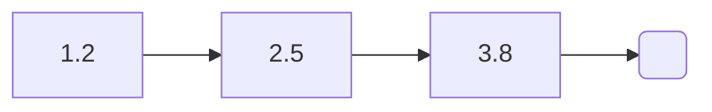
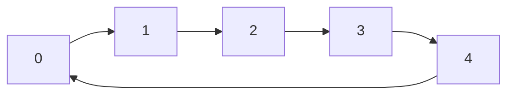
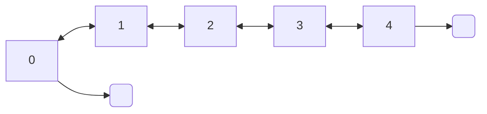
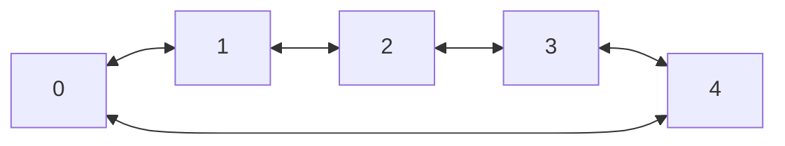

### Array list

```c 
int i; 
ArrayList *l;

l = new_array_list(int_m);   

for(i = 0; i < 5; i++)  
    l->d->append(l, &i);
    
l->d->free(&l);  
```   
**[ 0 ][ 1 ][ 2 ][ 3 ][ 4 ]**


#### Sorting

##### Bubble sort
```c
l->d->bubble_sort(&l, l->d->td->str_lt);  /*  */
```

##### Insertion sort
```c
l->d->insertion_sort(&l, l->d->td->str_lt);  /*  */
```

##### Selection sort
```c
l->d->selection_sort(&l, l->d->td->str_lt);  /*  */
```

##### Merge sort
```c
l->d->merge_sort(&l, l->d->td->str_lt);  /*  */
```

##### Quick Sort
```c
l->d->quick_sort(&l, l->d->td->str_lt);  /*  */
```

### Linked list

```c 
float x; 
LinkedList l;  

x = 1.2f; 
l = new_linked_list(&x, float_m);
x = 2.5f;  
l->d->append(&l, &x);  
x = 3.8f;  
l->d->append(&l, &x);

l->d->free(&l); 
```



#### Append

```c
/* [] */
x = 2.5f;  
l->d->append(&l, &x);  
x = 1.2f;  
l->d->append(&l, &x);
/* [2.5, 1.2] */
```

#### Prepend
```c
/* [] */
x = 2.5f;  
l->d->prepend(&l, &x);  
x = 1.2f;  
l->d->prepend(&l, &x);
/* [1.2, 2.5] */
```

#### Sorting

##### Merge sort
```c
l->d->merge_sort(&l, l->d->td->str_lt);  /*  */
```

#### To dot
```c
l->d->to_dot(l, "linkedlist.dot");
```

### Circular linked list

```c
int x; 
CircularLinkedList l;    
x = 5;
l = new_circular_linked_list(&x, int_m);    
l->d->append(&l, &x); l->d->free(&tmp);    
``` 



### Double linked list  
  
```c 
int x;
DoubleLinkedList l;    
x = 5; 
l = new_double_linked_list(&x, int_m);  
l->d->append(&l, &x); l->d->free(&tmp);
```



### Circular double linked list  

```c

int x;
CircularDoubleLinkedList l;
x = 5;
l = new_circular_double_linked_list(&x, int_m);
l->d->append(&l, &x); l->d->free(&tmp);

```



### List
The list interface provides basic methods for the different list implementation

A circular linked list of char:

```c  
List *l;  
  
l = new_list(LINKED_LIST, str_m);  
  
/* add some values */  
l->append(l, "hell");  
l->append(l, "shell");  
l->append(l, "Foo");  
l->append(l, "bar");  
l->append(l, "Bubble");  
    
l->free(&l);  
```  

#### Extended use of lists implementation
Some list implementation have specific methods, other don't. So you will have to understand how structs are shaped. For example if you want to benefit of the sorting methods of the *ArrayList* you would do:

```c  
l = new_list(ARRAY_LIST, int_m);  
...  
l->s.array_list->d->merge_sort(&l->s.array_list);  
```  
You will notice that here we access the *ArrayList* implementation through the **s** (for "structure") field, depending on the type of implementation we set to create the *List*.

#### Methods
[Header file](https://github.com/cydaw6/MyLittleCLibrary/blob/main/include/Lists/MLCL_List.h)
