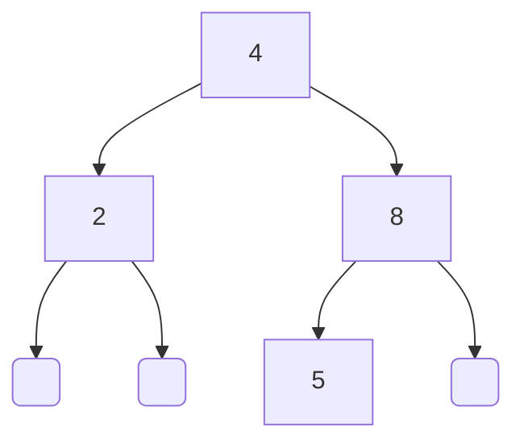

### Binary search tree

```c  
int x;  
BinarySearchTree l;  
  
x = 4;  
l = new_binary_search_tree(&x, int_m);
  
x = 8; l->d->add(&l, &x);  
x = 2; l->d->add(&l, &x);
x = 5; l->d->add(&l, &x);

l->d->free(&tmp);  
```  


### AVL tree


```c  
int x;  
AVLTree l;  
  
x = 4;  
l = new_avl_tree(&x, int_m);
  
x = 8; l->d->add(&l, &x);  
x = 2; l->d->add(&l, &x);
x = 5; l->d->add(&l, &x);

l->d->free(&tmp);  
```  
