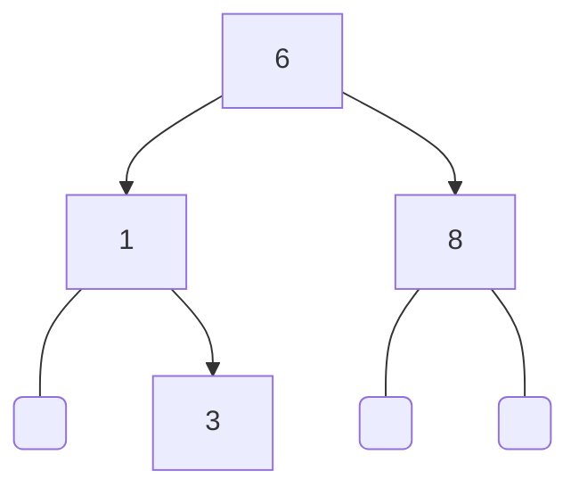
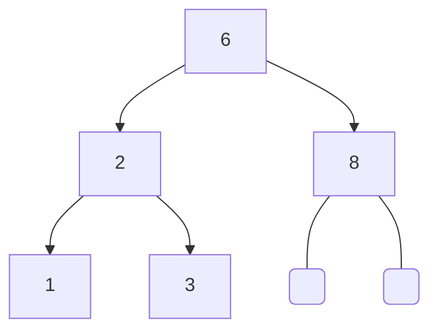
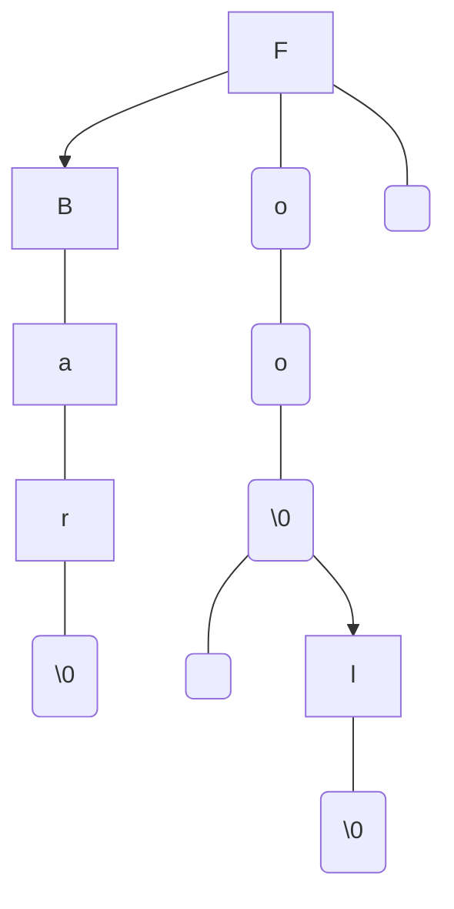
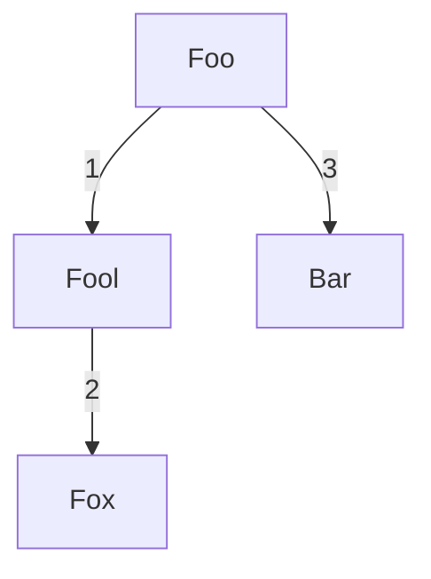

### Binary search tree

<div style="text-align: center;">

</div>

```c  
BinarySearchTree *tree = new_binary_search_tree(int_m);

binary_search_tree_add(tree, new_int(6));    
binary_search_tree_add(tree, new_int(8));  
binary_search_tree_add(tree, new_int(1));
binary_search_tree_add(tree, new_int(3));

binary_search_free(&tree);  
```  


### AVL tree

<div style="text-align: center;">

</div>

```c  
AVLTree *tree = new_avl_tree(int_m);

binary_search_tree_add(tree, new_int(6));    
binary_search_tree_add(tree, new_int(8));  
binary_search_tree_add(tree, new_int(1));
binary_search_tree_add(tree, new_int(3));
binary_search_tree_add(tree, new_int(2));

binary_search_free(&tree);  
``` 

### Ternary Search Tree (Lexical Tree)

<div style="text-align: center;">

</div>


```c
TernarySearchTree *tree = new_ternary_search_tree();

ternary_search_tree_add(tree, "Foo");
ternary_search_tree_add(tree, "Bar");
ternary_search_tree_add(tree, "Fool");

ternary_search_tree_free(&tree);
```

### BK Tree

<div style="text-align: center;">

</div>


```c
BKTree *tree = new_bk_tree();

bk_tree_add(tree, "Foo");
bk_tree_add(tree, "Bar");
bk_tree_add(tree, "Fool");
bk_tree_add(tree, "Fox");

bk_tree_free(&tree);
```

#### Fuzzy search