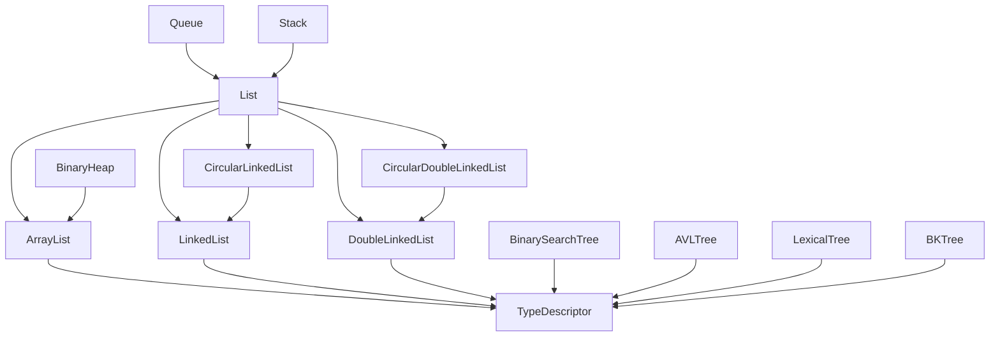
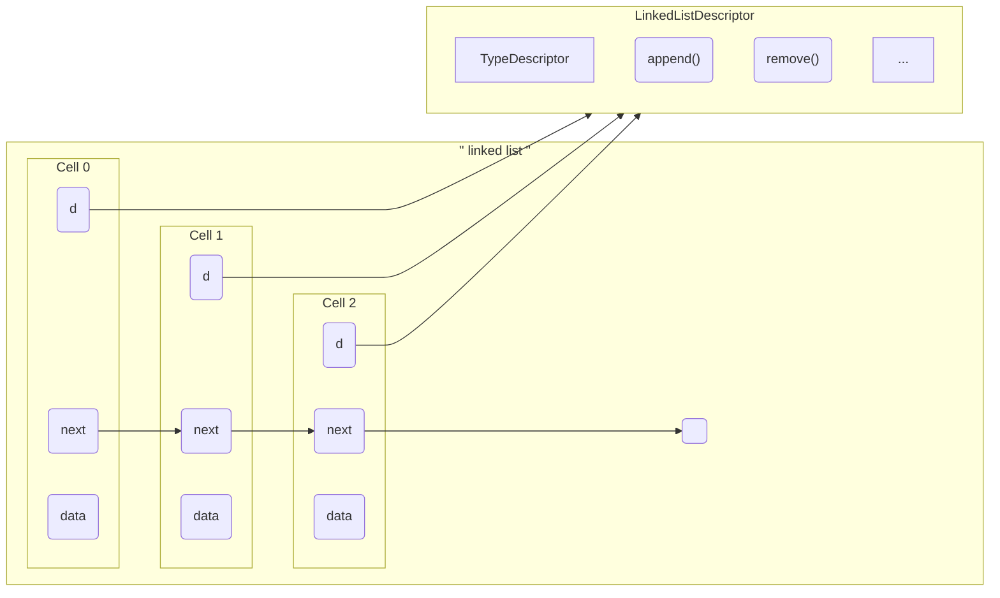

## Introduction

The basic structures  the linked to a descriptor (called 'd') trough which they pass to use the associated functions, and the [type descriptor](##Type-manifest), allowing to manipulate the data independently of the *effective* type they are carrying.  You specify the data carried by the structure at creation.

For example the linked list is implemented like this : [see annex](#Linked-list-implementation). Each cell is linked to the linked list descriptor, when adding new data to the list, a cell (the last, the first, depending on the function) is passing his 'd' pointer to the cell builder. The type descriptor is freed when the last remaining cell is removed.
You use the linked list this way:
```c
LinkedList l;
int x;

x = 1;
l = new_linked_list(&x, int_m);

/* 
   You have to way of using the struct functions
   By using the descriptor 
*/
x = 2;
l->d->append(&l, &x);

/* Or by using the global function name */
x = 3;
linked_list_append(&l, &x);
```
The functions of a structures call other function trough the descriptor.

By doing so, we can override the methods behavior be using custom ones
`l->d->append = mycustomappendfunction; `
or

```c
void custom_fprint_for_the_data_of_my_linked_list(FILE * stream, const void * data){
	if(stream && data)
		fprintf("***-- %c --***", *(char *) data);
}
...
LinkedList l;
char c;

c = 'a';
l = new_linked_list(&x, int_m);
l->d->type_descriptor->fprint = custom_fprint_for_the_data_of_my_linked_list;
```


### Structures inheritance



### Linked list implementation

