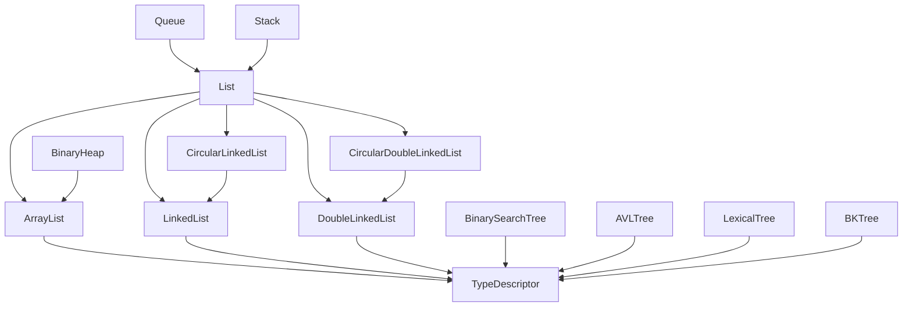
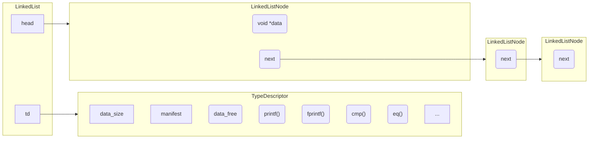

## Introduction

The structures are linked to a type descriptor (called 'td') trough which they use the associated functions, allowing to manipulate the data independently of the *effective* type they are carrying.  You specify the data carried by the structure at creation.
For example the linked list is implemented like [this](#linked-list-implementation).

You use the linked list this way:
```c
LinkedList *l = new_linked_list(int_m);
linked_list_append(l, new_int(3));
```
As the functions of a structures call other functions through the descriptor, we can override the methods behavior be using custom ones (so, on the modified structure only).

```c
void my_custom_fprintf(const void *data, FILE *stream){
    fprintf("[--- %c ---]", *(char *) data);
}
...
LinkedList *l = new_linked_list(char_m);
l->td->fprint = my_custom_fprintf;
```


### Structures inheritance



### Linked list implementation


Basically all structures are implemented this way.